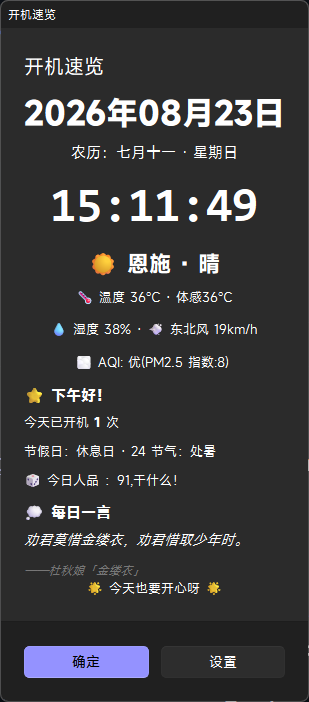
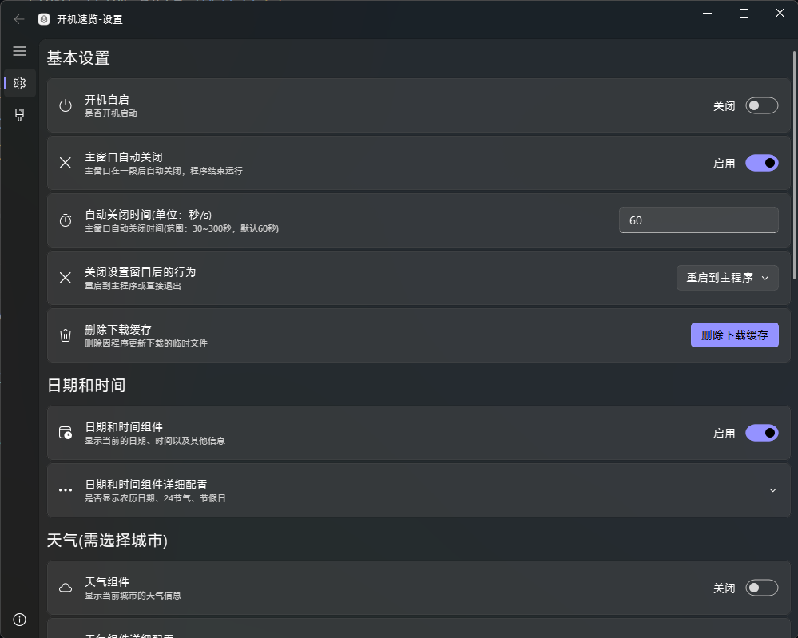

<div align="center">


<h1>StartInfo</h1>

<p>一个基于 PySide6 + QFluentWidgets 开发的桌面信息展示工具。</p>

[](https://github.com/HuangTao313/StartInfo)
[](LICENSE)
[](https://github.com/HuangTao313/StartInfo/releases)
[](https://github.com/HuangTao313/StartInfo/releases)

</div>

# 功能

* 天气与空气质量
* 日期、时间、农历、24 节气、节假日
* 历史上的今天
* 今日人品
* Minecraft 服务器信息
* 更多功能……

## 截图

<table>
  <tr>
    <td style="text-align: center;">主界面</td>
    <td style="text-align: center;">设置界面</td>
  </tr>
  <tr>
    <td></td>
    <td></td>
  </tr>
</table>

## 下载

目前提供 Windows 安装版和便携版。


### Windows

**系统要求：**

- Windows 10 及以上版本
- 仅支持 64 位（x86_64）系统

**版本说明：**

- **安装版**：使用安装程序安装 StartInfo，适合大多数用户。
- **便携版**：无需安装，解压后即可使用，适合希望将程序放在指定目录或移动设备上的用户。

下载最新版本：

- 安装版：[StartInfo-win-x86_64-Setup.exe](https://github.com/HuangTao313/StartInfo/releases/latest/download/StartInfo-win-x86_64-Setup.exe)
- 便携版：[StartInfo-win-x86_64-Portable.zip](https://github.com/HuangTao313/StartInfo/releases/latest/download/StartInfo-win-x86_64-Portable.zip)

> 下载链接始终指向 GitHub 最新 Release 中对应的文件。
> 
> macOS 已完成相关功能适配，但目前暂未提供 macOS 构建版本。

## 从源码运行

首先克隆项目：

```bash
git clone https://github.com/HuangTao313/StartInfo.git
cd StartInfo
```

使用 uv 同步项目依赖：

```bash
uv sync
```

### 运行

StartInfo 的源码入口为 `main.py` 和 `settings.py`，可以根据需要直接运行。

**启动主程序：**

```bash
uv run main.py
```

**直接启动设置页面：**

```bash
uv run settings.py
```

`core` 目录为 StartInfo 的核心功能模块，是项目内部自制的核心库，不作为独立程序运行。

`core` 中的文件由 `main.py`、`settings.py` 等入口间接调用，**无需也不建议直接运行 `core` 目录中的文件**。


## 启动参数

StartInfo 支持以下启动参数，可用于调试、故障排查以及特定场景下的功能调用。

以下示例分为两种运行方式：

* **源码运行**：使用 `uv run main.py`，适用于开发和调试。
* **已编译版本**：使用 `StartInfo.exe`，适用于普通用户。

除特别说明外，两种运行方式支持的启动参数相同。

### `--settings`

跳过主程序流程，直接启动设置页面。

当主程序无法正常启动，但设置页面仍可以正常运行时，可以使用此参数进入设置。

**源码运行：**

```bash
uv run main.py --settings
```

**已编译版本：**

```powershell
StartInfo.exe --settings
```

### `--debug`

临时将本次启动的日志等级强制设置为 `DEBUG`，用于调试和问题排查。

该参数**不会修改设置中保存的日志等级**。不使用 `--debug` 启动时，程序仍会使用设置页面中保存的日志等级。

**源码运行：**

```bash
uv run main.py --debug
```

**已编译版本：**

```powershell
StartInfo.exe --debug
```

本次启动会使用 `DEBUG` 日志等级；下次正常启动时，仍然使用设置中原本配置的日志等级。

`--debug` 不属于启动入口参数，可以与 `--settings` 同时使用：

```bash
uv run main.py --settings --debug
```

已编译版本：

```powershell
StartInfo.exe --settings --debug
```

### `--startup`

用于标识 StartInfo 是否由**开机自启动项**启动。

该参数主要由 StartInfo 的开机启动功能自动添加，通常不需要用户手动指定。

启用开机自启动后，StartInfo 创建的启动项会自动附加 `--startup` 参数。程序启动时可以根据该参数判断当前启动是否属于开机自启动，并由此配合开机次数组件统计开机次数。

已编译版本的启动项实际使用形式类似：

```powershell
StartInfo.exe --startup
```

> `--startup` 属于内部用途参数，一般情况下无需手动添加或修改。


### 参数优先级

`--debug` 不属于启动入口，可以与 `--settings` 同时使用。

例如：

```bash
uv run main.py --settings --debug
```

## 模板文件

StartInfo 支持接收 Jinja2 模板文件路径作为启动参数。

可以将模板文件直接拖拽到 StartInfo 的程序图标上。StartInfo 启动后会识别传入的模板文件，并询问是否将该模板添加到模板目录。

该功能主要用于方便用户快速添加自定义模板。

## 日志与调试

StartInfo 使用 Loguru 记录运行日志。

默认日志等级为 `WARNING`，因此正常运行时不会记录大量普通运行信息。

日志文件默认保留 **3 天**，过期日志会自动清理。

如果遇到程序运行异常，可以使用 `--debug` 参数启动程序，以记录更详细的 DEBUG 级别日志，并在反馈问题或提交 Issue 时附上相关日志。

## 更新机制

StartInfo 支持多个更新源：

* GitHub (默认)
* GitHub 镜像站

为了避免更新接口被频繁请求，StartInfo 会对版本检查结果进行本地缓存。

版本信息缓存默认有效期为 **10分钟**。在缓存有效期间，再次检查更新不会重新请求服务器。

因此，如果 StartInfo 已经检查过一次更新，即使之后立即发布了新版本，用户也可能需要等待当前缓存过期后才能检测到新版本。

这是为了降低更新接口的请求压力，并避免更新接口被频繁请求。

## 和风天气配置

如果使用和风天气作为天气数据源，需要在设置中配置自己的 API Host 和 API Key。

### 获取 API Host 和 API Key

1. 前往 [和风天气开发平台](https://dev.qweather.com/) 注册并登录账号。
2. 创建项目并获取 API Key。
3. 在开发控制台的设置页面查看自己的 API Host。

StartInfo 需要同时使用 API Host 和 API Key 才能正常请求和风天气 API。

### 在 StartInfo 中配置

打开 StartInfo 的设置页面，在天气相关设置中填写：

- **API Host**：填写和风天气控制台提供的 Host。
- **API Key**：填写和风天气控制台生成的 API Key。

API Host 的格式类似：

```text
xxxxxxxx.re.qweatherapi.com
```

填写 API Host 时，**不要添加 `https://` 或 `http://`**，StartInfo 会自动处理请求地址。

API Key 请直接填写控制台提供的 Key，无需添加引号或其他内容。

配置完成后，将天气数据源切换为和风天气即可。

> 和风天气 API Host 与 API Key 均与开发者账号相关，请使用自己的 API Host 和 API Key，不要使用他人的配置。

如果暂时不使用和风天气，可以切换至小米天气数据源。

## 安全说明

项目历史提交中曾出现过部分 API Key，目前这些 Key 均已全部重置并失效。

使用相关 API 时，请配置自己的 API Key。

## 文档

- [模板自定义文档](docs/template-customization.md)
- [组件开发文档](docs/widget-development.md)

> 目前 StartInfo 暂不支持插件系统，现有 Widget 均为内置组件，统一位于 [core/widgets.py](core/widgets.py)。

## 依赖

StartInfo 主要使用以下项目：

- [Python](https://www.python.org/)
- [PySide6](https://doc.qt.io/qtforpython-6/gettingstarted.html#getting-started)
- [PySide6-Fluent-Widgets](https://github.com/zhiyiYo/PyQt-Fluent-Widgets/tree/PySide6)
- [Loguru](https://github.com/Delgan/loguru)

## AI 辅助开发

本项目开发过程中使用了 AI 辅助编程（Vibe Coding），包括代码编写、重构、调试、问题分析等。

项目的整体设计、功能规划、代码审查与最终维护由作者负责。

## 致谢

感谢以下项目和资源：

- [Class-Widgets](https://github.com/Class-Widgets/Class-Widgets) — 部分设计思路参考
- [QWidgetSekai](https://github.com/Aegisir/QWidgetSekai) — 设置页面开关按钮移植自其 [switch_button.py](https://github.com/Aegisir/QWidgetSekai/blob/main/pyqt_project/SwitchButton/src/switch_button.py)，原始实现基于 PyQt5，已移植至 PySide6
- ### 接口与资料

- [XiaomiWeather API](https://github.com/huanghui0906/API/blob/master/XiaomiWeather.md) — 小米天气接口资料参考

### 图标资源

- [AppIcon Forge](https://github.com/zhangyu1818/appicon-forge) — 用于生成应用程序图标
- [Material Design Icons](https://github.com/google/material-design-icons) — 主程序图标资源来源
- [Fluent UI System Icons](https://github.com/microsoft/fluentui-system-icons) — 设置窗口图标资源来源

## 贡献者

感谢参与 StartInfo 开发、测试和反馈的贡献者。

<p>
  <a href="https://github.com/HuangTao313">
    
  </a>
  <a href="https://github.com/Yuuka-doesnt-know">
    
  </a>
</p>

## 版权

本项目采用 GNU GPLv3.0 许可证开源。

完整许可证内容请参见项目根目录的 [LICENSE](LICENSE) 文件。

#

Copyright © 2023-2026 HuangTao313. Licensed under GPL-3.0.